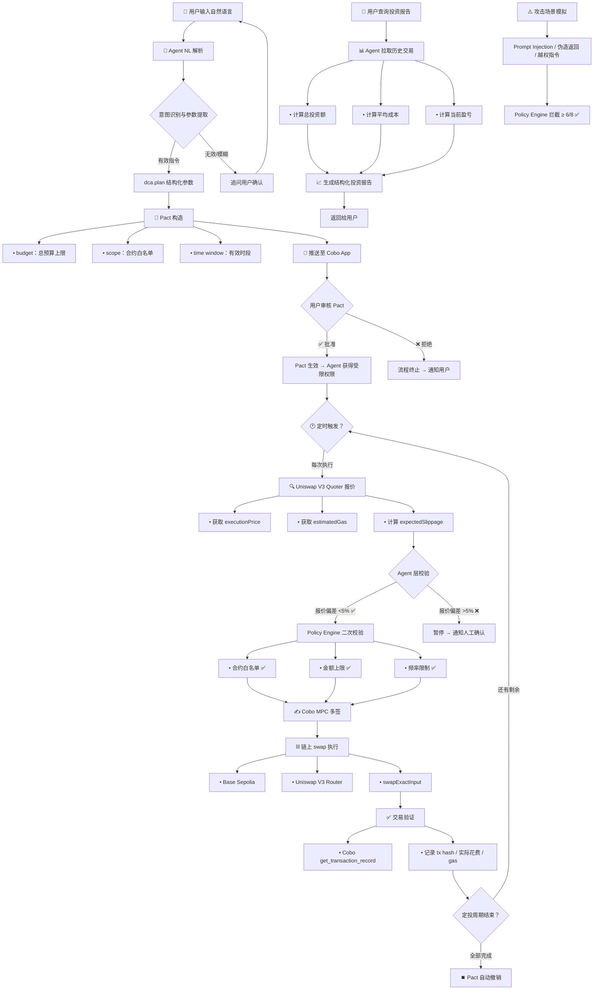

# Project Flow Diagram — DCA Automation Agent

> 项目最小闭环流程图
> 赛道：Cobo｜Agentic Economy × Cobo Agentic Wallet

---

## 完整流程图



---

## 文本版流程图（备选）

### 主流程

```
用户输入 NL 意图
    ↓
① Agent NL 解析 → dca.plan（结构化参数）
    ↓
② Pact 构造（budget / scope / time window）
    ↓
③ 用户 Cobo App 审核批准
    ↓
④ Quoter 报价 → Agent 校验 → Policy Engine 校验
    ↓
⑤ Cobo MPC 多签 → 链上 swap 执行（Base Sepolia）
    ↓
⑥ 交易验证 → 写入日志
    ↓
⑦ 重复 ④-⑥ 直到定投周期结束
    ↓
⑧ Pact 自动撤销
```

### 用户查询流程

```
用户查询「我现在定投情况怎么样」
    ↓
① Agent 拉取 Cobo 历史交易记录
    ↓
② 获取当前 token 价格
    ↓
③ 计算：总投资额 / 平均成本 / 当前市值 / 盈亏
    ↓
④ LLM 生成结构化投资报告
    ↓
返回给用户
```

---

## 各环节角色

| 环节 | 角色 | 自动/人工 |
|------|------|:--------:|
| NL 意图输入 | 用户 | 👤 人工 |
| 意图解析 → 结构化参数 | Agent | 🤖 自动 |
| Pact 审核 | 用户（Cobo App） | 👤 人工 |
| Uniswap 报价 | Agent（链上调用） | 🤖 自动 |
| Agent 层校验（报价偏差） | Agent | 🤖 自动 |
| Policy Engine 校验 | Cobo | 🤖 自动 |
| MPC 签名 | Cobo | 🤖 自动 |
| Swap 执行 | Cobo contract_call | 🤖 自动 |
| 交易验证 | Agent（Cobo API） | 🤖 自动 |
| 投资报告生成 | Agent（LLM） | 🤖 自动 |
| 异常中断 / 预算超额 | Agent → 通知用户 | 👤 人工介入 |

---

## 数据流

```
用户 ←→ Agent
   NL 意图输入
   投资报告输出
   异常通知

Agent ←→ Cobo API
   Pact 创建 / 查询 / 撤销
   contract_call 发起
   get_transaction_record 查询

Agent ←→ Base Sepolia (RPC)
   Uniswap V3 Quoter 报价

Cobo ←→ Base Sepolia
   MPC 签名 → 广播交易
```

---

*Hackathon 项目 · DCA Automation Agent · AI × Web3 School Cohort 0 · 2026-06*
*流程图：用户输入 → Agent 处理 → Web3 机制 → 链上执行 → 结果输出 → 验证*
